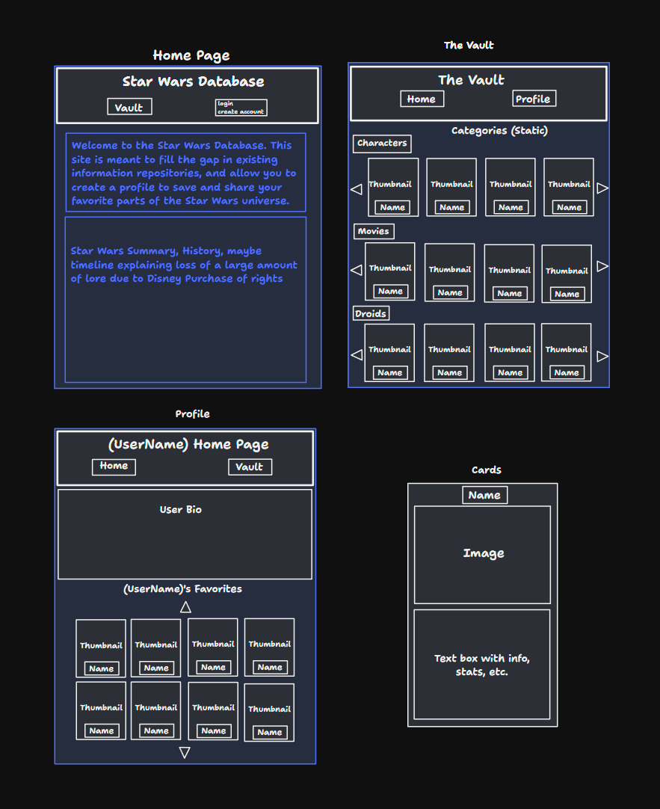

## Summary

Star Wars database with user accounts profiles, and favorites, calling from Star Wars API and Star Wars Databank API.

Requirements-
  Main page with Nav bar to include search bar (with autocomplete?)
  Information page with different backgrounds as you scroll down through categories, with informational cards that pop up when results are selected.
  favorites linked to user, and on profile page
  User signup
  user profile pages
 Wish list / Future Improvements for portfolio-
  Stretch- Rasa AI assistant to search APIs for longer form answers to user questions
  Final stretch- AWS  

## Resources

- Wookiepedia "https://starwars.fandom.com/wiki/Main_Page"
- Star Wars API "https://swapi.dev/"
- Star Wars Databank "https://starwars-databank.vercel.app/"
- Official Star Wars Database "https://www.starwars.com/databank"
- Autocomplete "https://github.com/pacosw1/react-autocomplete/tree/master/src/components"
- Backgroud scrolling image for categories https://imagekit.io/blog/lazy-loading-images-complete-guide/

### `<Navbar>`

- Visible on every page
- Heading "Star Wars Database"
- Quote of the day
- Links to the Home Page (not when on home page) (`/`), Vault page (same) (`/vault`) and the Profile Page (same) (`/profile`)
- Log In/Sign Up button that leads to log in sign up page. Button is replaced by Logout button if user is logged in
- Input section with an associated button that allows for searching the Vault from any category by name (search two apis from one search bar)

### `<Footer />`

- contact admin link (sends email)
- link to GitHub?
- about Rasa AI
- other info?

### `<Rasa Assistant />`

- pop up chat box while on home page, all othe pages Rasa will be minimized, but big enough pop up button to be visible
- Stretch Armstrong- use animated protocol droid as Avatar with pop-up dialogue box
- train to search both APIs for longer form answers for users, and for images to use on their profiles

### `<HomePage />`

- The Home Page should be rendered (along with the Navbar) at `/`
- It should have the title 'Welcome to the Star Wars Database'
- Info breakdown for star wars overall (from wookipedia)
- Background?

### `<LogIn/SignUp />`

- username field checks to see if username is already taken. Cannot create account if it is.
- password field with rules for strong password, weak/strong bar under
- two buttons "create account", "log in"

### `<Account Info />`

- enter email
- select organization alignment
- write bio
- progress bar at bottom of page, with skip button and next button
- "complete" sends user to profile page

### `<ProfilePage />`

- bio
- displayed emblem for organization (org theme as auto background?)
- favorites in category boxes under bio

### `<Vault />`

- right/left arrow scrolling rows for each category
- when you select a result from the vault it directs to an informational page
  Categories-
  - 'Films'
     - make films list database within this project, with data pulled from wookeipedia.
  - 'Characters'
     - https://starwars-databank-server.vercel.app/api/v1/characters
     - all results from the starwars-databank-server will have attributes in this format
       example-
       -_id: "640b44d4a1996bc1b0f1c2d5",
       - name: "Abednedo",
       - description: "A gregarious and clever species, Abednedos are common sights in the galaxy, pursuing a range of professions on many planets. They hail from a planet of the same name, which is noted for its sprawling, colorful and chaotic cities. After the Battle of Endor, the Empire attacked Abednedo with a climate-disruption array; as a result, many Abednedos support the New Republic or the Resistance. Their native language is Abednedish, though many speak Basic.",
       - image: "https://lumiere-a.akamaihd.net/v1/images/tlj-abednedo-databank-main-image_bd8babfb.jpeg",
       - __v: 0
  - 'Droids'
     - https://starwars-databank-server.vercel.app/api/v1/droids
  - 'Creatures'
     - https://starwars-databank-server.vercel.app/api/v1/creatures
  - 'Locations'
     - https://starwars-databank-server.vercel.app/api/v1/locations
  - Organizations'
     - https://starwars-databank-server.vercel.app/api/v1/organizations
  - 'Species'
      - https://starwars-databank-server.vercel.app/api/v1/species
  - 'Starships'
      - https://swapi.dev/api/starships
      - endpoints are like so-
        - /starships/ -- get all the starship resources
        - /starships/:id/ -- get a specific starship resource
        - /starships/schema/ -- view the JSON schema for this resource
      - attributes are as follows
        - name string -- The name of this starship. The common name, such as "Death Star".
        - model string -- The model or official name of this starship. Such as "T-65 X-wing" or "DS-1 Orbital Battle Station".
        - starship_class string -- The class of this starship, such as "Starfighter" or "Deep Space Mobile Battlestation"
        - manufacturer string -- The manufacturer of this starship. Comma separated if more than one.
        - cost_in_credits string -- The cost of this starship new, in galactic credits.
        - length string -- The length of this starship in meters.
        - crew string -- The number of personnel needed to run or pilot this starship.
        - passengers string -- The number of non-essential people this starship can transport.
        - max_atmosphering_speed string -- The maximum speed of this starship in the atmosphere. "N/A" if this starship is incapable of atmospheric flight.
        - hyperdrive_rating string -- The class of this starships hyperdrive.
        - MGLT string -- The Maximum number of Megalights this starship can travel in a standard hour. A "Megalight" is a standard unit of distance and has never been defined before within the Star Wars universe. This figure is only really useful for measuring the difference in speed of starships. We can assume it is similar to AU, the distance between our Sun (Sol) and Earth.
        - cargo_capacity string -- The maximum number of kilograms that this starship can transport.
        - consumables *string
          The maximum length of time that this starship can provide consumables for its entire crew without having to resupply.
        - films array -- An array of Film URL Resources that this starship has appeared in.
        - pilots array -- An array of People URL Resources that this starship has been piloted by.
        - url string -- the hypermedia URL of this resource.
        - created string -- the ISO 8601 date format of the time that this resource was created.
        - edited string -- the ISO 8601 date format of the time that this resource was edited.
  - 'Vehicles'
      - https://starwars-databank-server.vercel.app/api/v1/vehicles
  - 'Planets'
      - https://swapi.dev/api/planets
      - attributes
        - name string -- The name of this planet.
        - diameter string -- The diameter of this planet in kilometers.
        - rotation_period string -- The number of standard hours it takes for this planet to complete a single rotation on its axis.
        - orbital_period string -- The number of standard days it takes for this planet to complete a single orbit of its local star.
        - gravity string -- A number denoting the gravity of this planet, where "1" is normal or 1 standard G. "2" is twice or 2 standard Gs. "0.5" is half or 0.5 standard Gs.
        - population string -- The average population of sentient beings inhabiting this planet.
        - climate string -- The climate of this planet. Comma separated if diverse.
        - terrain string -- The terrain of this planet. Comma separated if diverse.
        - surface_water string -- The percentage of the planet surface that is naturally occurring water or bodies of water.
        - residents array -- An array of People URL Resources that live on this planet.
        - films array -- An array of Film URL Resources that this planet has appeared in.
        - url string -- the hypermedia URL of this resource.
        - created string -- the ISO 8601 date format of the time that this resource was created.
        - edited string -- the ISO 8601 date format of the time that this resource was edited.

### `<Error404Page />`
- page that all non-matching urls redirect to

### `<MissingResourcePage />`
- page that renders only when the search bar is given a resource that it has no match for.

### Basic Layout

## Functionality

Functionality to include:

- button for each resource will read 'Add to Favorites' if not yet added and 'Remove from Favorites' if already on the list

- A favorite cannot be added twice

- No more than 30 favorites at once

- On bad urls, redirect to a 404 page